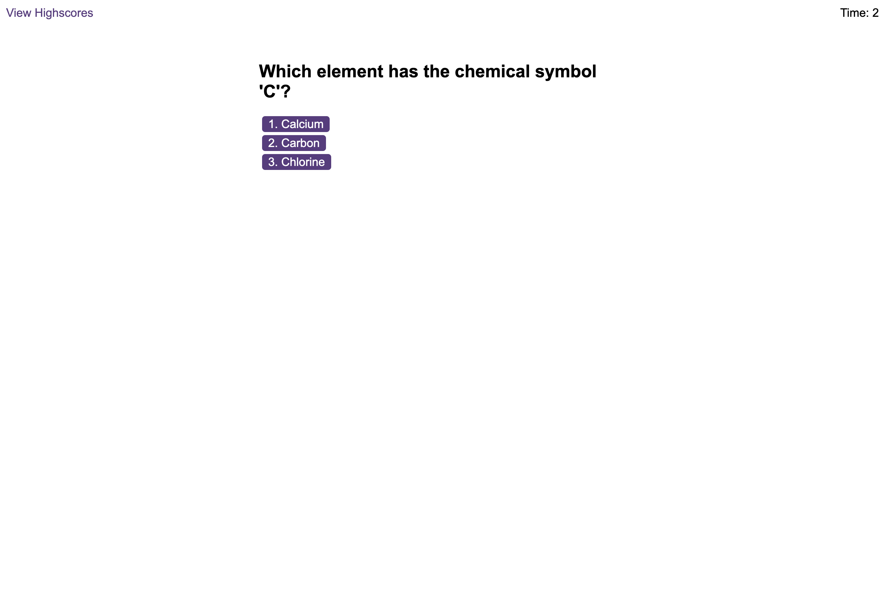

# Coding Quiz

## Description
This is project is coding quiz challenge. Users are shown a series of questions presented in a random order and are against the clock as they try to answer as many questions as possible. Incorrect answers are penalised heavily and users will lose 10 seconds of their available time for every incorrect answer! At the end of each game, users can  choose to have their scores stored as a high score. High scores are persisted to local storage and can be viewed in the dedicated high scores page.  



## Installation

Please clone this repository with the following command in your terminal:

```
git clone https://github.com/jamesaps/code-quiz.git
```

## Usage
This site is designed to automatically deploy to github pages when changes are committed to the main branch. You can find a link to a live version of the site [here](https://jamesaps.github.io/code-quiz/).

## Credits
* Array shuffle algorithm provided by: [Fisher-Yates Shuffle](https://stackoverflow.com/a/2450976)
* ChatGPT 3.5 was used to generate the questions in this project
* Starter code was provided by eDX


## License

Licensed under the [MIT](https://github.com/jamesaps/code-quiz/blob/main/LICENSE) license.

© 2024 James Stott. Confidential and Proprietary. All Rights Reserved.
